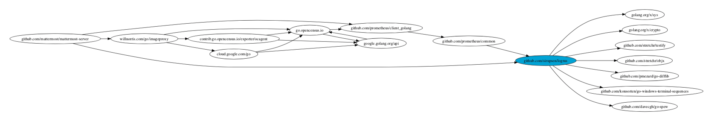

# Go Mod Mode

This package contains a number of conveniences when working with Go modules such as syntax highlighting for go.mod and go.sum files, commands to work with the `go mod` tool from inside Emacs, and integrations with Eldoc and flycheck.

## Installation
This package is still not in MELPA yet so you would have to manually install this package by making sure the go-mod-mode.el file is inside your load path.

## Contributing
Help in any way would be greatly appreciated. Suggestions, bug reports, ideas for improvement, code reviews would all be great.

## Usage
The commands that this package provides is as follows:

### go-mod-create-local
Using the tool gohack, create a copy of the selected module in `~/gohack` and update the go.mod file to use the new copy. Before Go modules, if you wanted to debug or test somethgin in one of our dependencies, you could Go into your Go path and modify any package's coad that you wanted. With Go modules this is not possible, and instead a copy must be created and pointed to.

### go-mod-undo-local
Again using the tool gohack, remove the replace directive in the go.mod file refering to the selected module. This command undos what `go-mod-create-local` does.

### go-mod-upgrade-all
This command runs `go get -u -m all`. If `C-u` argument is provided to the command, it will upgrade all packages to their latest patch.

### go-mod-get
For the selected Go module, select the version to set the module to from a list of all available versions.

### go-mod-graph

Generate a graph of all dependencies for the selected module.

## Eldoc Support
With Eldoc turned on, after loading all of the version information upon loading the go.mod file, for each module on current line, a list of the current version at, what it is being replaced by, and what version it could be upgraded to is listed.

## Flycheck support
This package also adds flychec support for go.mod files showing any syntax errors. To install, you should run the command *flycheck-go-mod-setup* to set up the checker. A configuration using use-package might look as follows:

```elisp
(use-package go-mod-mode
  :ensure t
  :config
  (progn
	(flycheck-go-mod-setup)))
```

## Projectile Configuration
If you are using the Projectile plugin and want it to recognise projects using a go.mod file you can add the following line to your configuration:

```elisp
(projectile-register-project-type 'go-mod '("go.mod")
                  :compile "go build ./..."
                  :test "go test ./..."
                  :run "go run ./..."
                  :test-suffix "_test.go")
```
